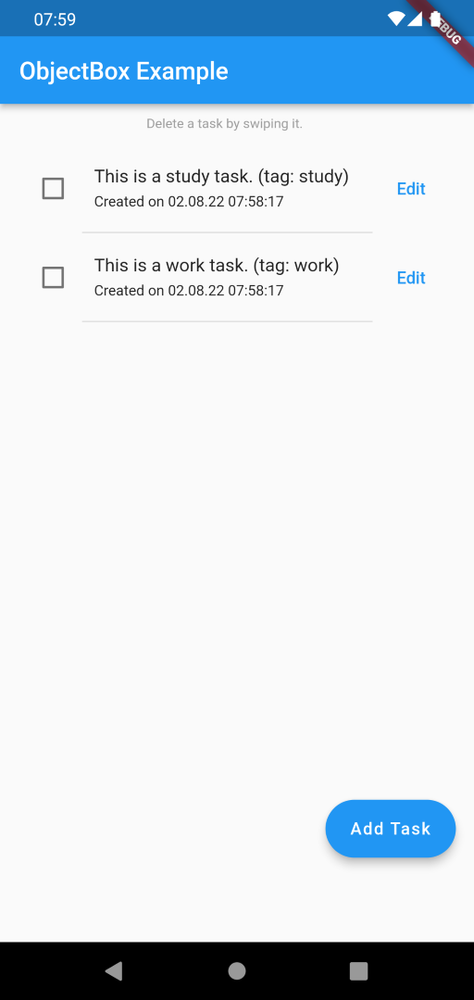

# ObjectBox example Flutter app using relations

This is a task-list example app that shows how to use ObjectBox in Flutter. 

See how to:
- write and annotate classes to create a data model ([model.dart](lib/model.dart))
- define a relation between Entities ([model.dart](lib/model.dart)) and use it ([objectbox.dart](lib/objectbox.dart))
- create a Store ([main.dart](lib/main.dart), [objectbox.dart](lib/objectbox.dart))
- create Boxes and put and delete Objects there ([objectbox.dart](lib/objectbox.dart))
- query for Objects ([objectbox.dart](lib/objectbox.dart) and [tasklist_elements.dart](lib/tasklist_elements.dart))
- add ObjectBox Admin for debug builds ([objectbox.dart](lib/objectbox.dart), [build.gradle](android/app/build.gradle))

## Docs
- [Getting started with ObjectBox](https://docs.objectbox.io/getting-started)
- [How to use ObjectBox Relations](https://docs.objectbox.io/relations)
- [ObjectBox Admin](https://docs.objectbox.io/data-browser)
